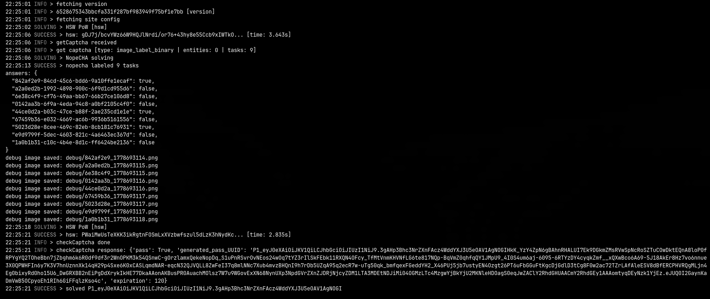

# hCaptcha Solver

Flask API to solve hCaptcha challenges. Uses NopeCHA for image labeling and Playwright for HSW proof-of-work.

## Setup

`pip install flask requests curl_cffi tls_client playwright Pillow numpy scipy PyJWT`

`playwright install chromium`

## Usage

`python api.py`

POST to `http://127.0.0.1:5000/solve` with JSON body `{"sitekey": "4c672d35-0701-42b2-88c3-78380b0db560", "rqdata": "optional"}`

`{"success": "true", "token": "P0_eyJ...", "took": "14.32"}`

For educational purposes only. I am not responsible for any illegal usage.
